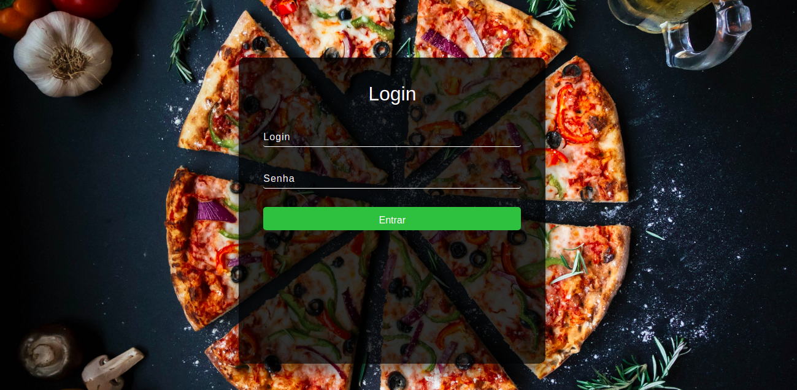
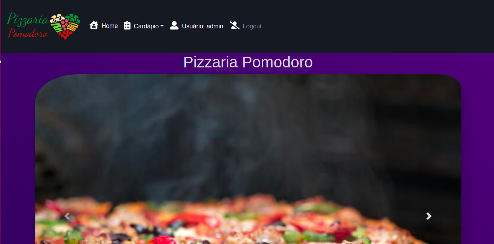

# Pizzaria Pomodoro

<strong>Tela de login - Pizzaria Pomodoro</strong>

<strong>Funcionalidades do site</strong>

Site simples de uma Pizzaria, crud básico de pizza e bebida node.js.

# Requisitos

# Instalacao das dependencias
