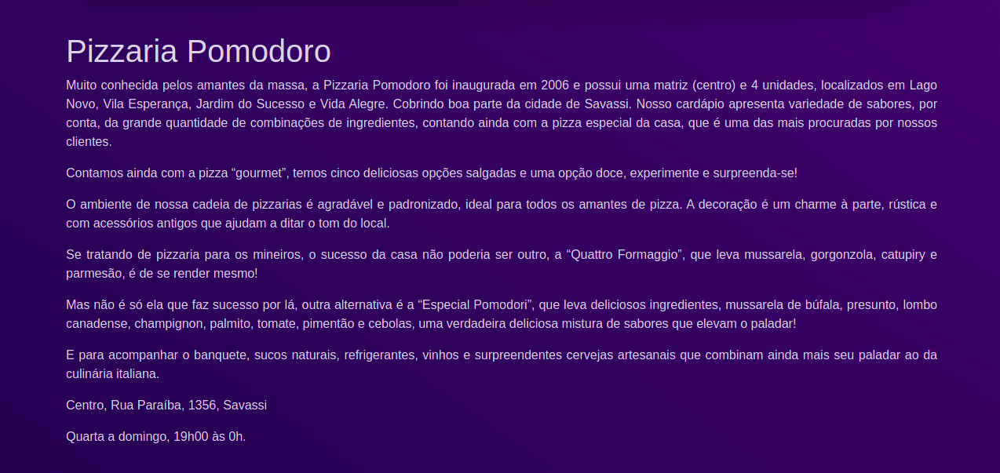
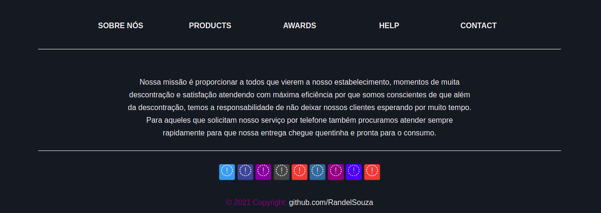

# Pizzaria Pomodoro

<strong>Tela de login</strong>

<strong>Funcionalidades do site</strong>

<strong>Listagem de pizzas na página inicial</strong>

<strong>Seção quem somos</strong>

<strong>Rodapé</strong>

<strong>Cardápio Pizzas</strong>

<strong>Cardápio Bebidas</strong>

# Requisitos
  * Nodejs instalado.  
  * mongodb.

# Instalacao das dependencias
